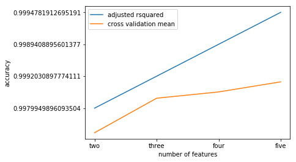

This is 

```python
get_ipython().run_line_magic('matplotlib', 'inline')
import numpy as np
import pandas as pd
import scipy
import sklearn
import matplotlib.pyplot as plt
import seaborn as sns
from sklearn import linear_model
import re
from scipy import stats
import statsmodels.formula.api as sm
from sklearn.naive_bayes import BernoulliNB
from sklearn.model_selection import cross_val_score

df = pd.read_csv("Google Drive/Python/FBIcrime.txt", skipfooter=3, skiprows=5, names=['City', 'Population', 'Violent_crime', 'Murder', 'Rape_revised', 'Rape_legacy', 'Robbery', 'Aggrevated_assault', 'Property_crime', 'Burglary', 'Larceny_theft', 'Motor_vehicle_theft', 'Arson'], engine='python')
```


```python
df['Violent_crime'] = df['Violent_crime'].apply(lambda x: int(x.replace(',', '')))
df['Robbery'] = df['Robbery'].apply(lambda x: int(x.replace(',', '')))
df['Population'] = df['Population'].apply(lambda x: int(x.replace(',', '')))
df['Burglary'] = df['Burglary'].apply(lambda x: int(x.replace(',', '')))
df['Larceny_theft'] = df['Larceny_theft'].apply(lambda x: int(x.replace(',', '')))
df['Rape_legacy'] = df['Rape_legacy'].apply(lambda x: int(x.replace(',', '')))
df['Property_crime'] = df['Property_crime'].apply(lambda x: int(x.replace(',', '')))
df['Aggrevated_assault'] = df['Aggrevated_assault'].apply(lambda x: int(x.replace(',', '')))
df['Motor_vehicle_theft'] = df['Motor_vehicle_theft'].apply(lambda x: int(x.replace(',', '')))
df['Rape_revised'] = df['Rape_revised'].fillna(0)
df['Arson'] = df['Arson'].fillna(0)
```


```python
for i, row in enumerate(df.columns[2:]):
    for j, row2 in enumerate(df.columns[i:]):
        if ((row2 != 'City') & (row2 != 'Population') & (row2 != 'Arson') & (row != 'Arson') & (row2 != row) & ((not row2.startswith("x_") & (not row.startswith("x_"))))):
            string = "x_" + row + "_" + row2
            string2 = "x_" + row2 + "_" + row
            if ((string not in df.columns) & (string2 not in df.columns)):
                df[string] = df[row] * df[row2]
```


```python
df_shuffle = df.sample(frac=1)
df_c = df_shuffle[df_shuffle.index % 5 != 0].copy(deep=True)
df_v = df_shuffle[df_shuffle.index % 5 == 0].copy(deep=True)
rsq = list()
cv = list()
```


```python
df_X1 = df_c[['Murder', 'Larceny_theft']]
df_Y1 = df_c['Population']
m_OLS1 = sm.OLS(df_Y1, df_X1).fit()
regr = linear_model.LinearRegression()
m_fit1 = regr.fit(df_X1, df_Y1)
cv_score1 = cross_val_score(m_fit1, df_X1, df_Y1, cv=5)
print(str(m_OLS1.rsquared_adj))
print(np.mean(cv_score1))
rsq.append(str(m_OLS1.rsquared_adj))
cv.append(np.mean(cv_score1))
```

    0.9979949896093504
    -0.7696259253698505


```python
df_X2 = df_c[['Murder', 'Larceny_theft', 'Burglary']]
df_Y2 = df_c['Population']
m_OLS2 = sm.OLS(df_Y2, df_X2).fit()
regr = linear_model.LinearRegression()
m_fit2 = regr.fit(df_X2, df_Y2)
cv_score2 = cross_val_score(m_fit2, df_X2, df_Y2, cv=5)
print(str(m_OLS2.rsquared_adj))
print(np.mean(cv_score2))
rsq.append(str(m_OLS2.rsquared_adj))
cv.append(np.mean(cv_score2))
```

    0.9992030897774111
    0.31053623303653055


```python
df_X3 = df_c[['Murder', 'Violent_crime', 'Burglary', 'Rape_legacy']]
df_Y3 = df_c['Population']
m_OLS3 = sm.OLS(df_Y3, df_X3).fit()
regr = linear_model.LinearRegression()
m_fit3 = regr.fit(df_X3, df_Y3)
cv_score3 = cross_val_score(m_fit3, df_X3, df_Y3, cv=5)
print(str(m_OLS3.rsquared_adj))
print(np.mean(cv_score3))
rsq.append(str(m_OLS3.rsquared_adj))
cv.append(np.mean(cv_score3))
```

    0.9989408895601377
    0.5074899375678589


```python
df_X4 = df_c[['Murder', 'Larceny_theft', 'Burglary', 'Rape_legacy', 'Aggrevated_assault']]
df_Y4 = df_c['Population']
m_OLS4 = sm.OLS(df_Y4, df_X4).fit()
regr = linear_model.LinearRegression()
m_fit4 = regr.fit(df_X4, df_Y4)
cv_score4 = cross_val_score(m_fit4, df_X4, df_Y4, cv=5)
print(str(m_OLS4.rsquared_adj))
print(np.mean(cv_score4))
rsq.append(str(m_OLS4.rsquared_adj))
cv.append(np.mean(cv_score4))
```

    0.9994781912695191
    0.8235705298160447


```python
fig, ax = plt.subplots()
plt.plot(rsq, label='adjusted rsquared')
plt.plot(cv, label='cross validation mean')
plt.xlabel('number of features')
plt.ylabel('accuracy')
plt.legend()
ax.xaxis.set_ticks(np.arange(0,4))
ax.set_xticklabels(["two", "three", "four", "five"])
```


    [Text(0,0,'two'), Text(0,0,'three'), Text(0,0,'four'), Text(0,0,'five')]



