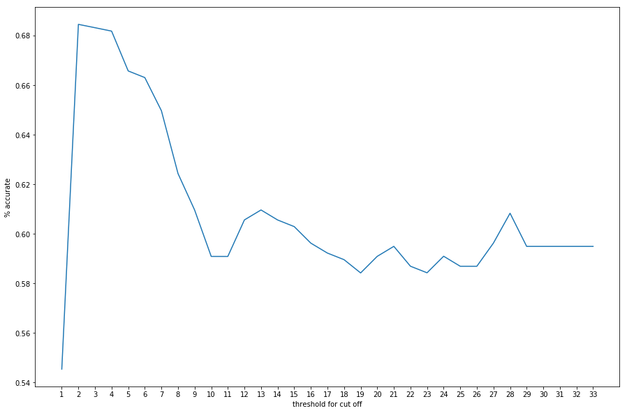
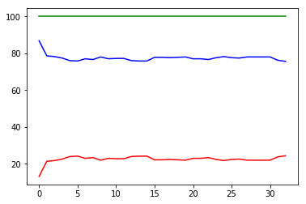
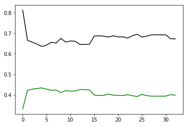

```python
get_ipython().run_line_magic('matplotlib', 'inline')
import numpy as np
import pandas as pd
import scipy
import sklearn
import matplotlib.pyplot as plt
import seaborn as sns
import re
from sklearn.naive_bayes import BernoulliNB
from sklearn.metrics import confusion_matrix

#df = pd.read_csv("Google Drive/Python/imdb_labelled.txt", delimiter= '\t', header=None)
#df = pd.read_csv("Google Drive/Python/yelp_labelled.txt", delimiter= '\t', header=None)
df = pd.read_csv("Google Drive/Python/amazon_cells_labelled.txt", delimiter= '\t', header=None)
df.columns = ['message', 'good_target']

#To make things easier, I will make everything lower case.
df['message'] = df['message'].str.lower()
good = list()

#Since the data contains characters that are not words, I remove those.  This includes ellipses and non-letters.
df['message'] = df['message'].str.replace('\.\.\.', ' ')
df['message'] = df['message'].apply(lambda x: re.sub(r'[^a-zA-Z ]', '', x))
df[df['good_target'] == 1]['message'].str.split().apply(good.extend)

#Here we count how many of each word appears and create a dictionary containing the number of appearances per word.
goodnumber = Counter(good)
goodfilter = list()
```


```python
threshold = 34
master_false_positive = []
master_false_negative = []
master_true_positive = []
master_true_negative = []
fold_results = []

for cut in range(1, threshold):
    goodfilter = list()
    for key, value in goodnumber.items():
        if value >= cut:
            if (key not in goodfilter):
                goodfilter.append(key)
    
    print("Words collected in filter " + str(len(goodfilter)))
    for key in goodfilter:
        df[str(key)] = df.message.str.contains(' ' + str(key) + ' ', case=False)
    
    df['allcaps'] = df.message.str.isupper()
    df['good_target'] = (df['good_target'] == 1)
    false_positive = []
    false_negative = []
    true_positive = []
    true_negative = []
    folds = 5
    print("Threshold is " + str(cut))
    for x in range(folds):
        df_shuffle = df.sample(frac=1)
        training = df_shuffle[df_shuffle.index % folds != x]
        validation = df_shuffle[df_shuffle.index % folds == x]
        bnb = BernoulliNB()
        training_test = training[goodfilter + ['allcaps']]
        validation_test = validation[goodfilter + ['allcaps']]
        bnb.fit(training_test, training['good_target'])
        y_pred = bnb.predict(validation_test) 
        accuracy = (validation['good_target'] != y_pred).sum()
        print("Number of mislabeled points out of a total {} points : {}".format(validation_test.shape[0], accuracy))
        cm = confusion_matrix(validation['good_target'], y_pred)
        fold_results.append(1 - accuracy / validation_test.shape[0])
        print(cm)
        false_positive.append(cm[0][1])
        false_negative.append(cm[0][0])
        true_positive.append(cm[1][1])
        true_negative.append(cm[1][0])
    master_false_positive.append(false_positive)
    master_false_negative.append(false_negative)
    master_true_positive.append(true_positive)
    master_true_negative.append(true_negative)

#print(fold_results)
```

    Words collected in filter 1109
    Threshold is 1
    Number of mislabeled points out of a total 200 points : 77
    [[83 18]
     [59 40]]
    Number of mislabeled points out of a total 200 points : 75
    [[93 12]
     [63 32]]
    Number of mislabeled points out of a total 200 points : 72
    [[77  7]
     [65 51]]
    Number of mislabeled points out of a total 200 points : 61
    [[86  9]
     [52 53]]
    Number of mislabeled points out of a total 200 points : 66
    [[95 20]
     [46 39]]
    Words collected in filter 437
    Threshold is 2
    Number of mislabeled points out of a total 200 points : 70
    [[77 24]
     [46 53]]
    Number of mislabeled points out of a total 200 points : 66
    [[85 20]
     [46 49]]
    Number of mislabeled points out of a total 200 points : 63
    [[70 14]
     [49 67]]
    Number of mislabeled points out of a total 200 points : 58
    [[75 20]
     [38 67]]
    Number of mislabeled points out of a total 200 points : 63
    [[86 29]
     [34 51]]
    Words collected in filter 284
    Threshold is 3
    Number of mislabeled points out of a total 200 points : 68
    [[76 25]
     [43 56]]
    Number of mislabeled points out of a total 200 points : 62
    [[86 19]
     [43 52]]
    Number of mislabeled points out of a total 200 points : 65
    [[68 16]
     [49 67]]
    Number of mislabeled points out of a total 200 points : 58
    [[76 19]
     [39 66]]
    Number of mislabeled points out of a total 200 points : 64
    [[85 30]
     [34 51]]
    Words collected in filter 209
    Threshold is 4
    Number of mislabeled points out of a total 200 points : 66
    [[78 23]
     [43 56]]
    Number of mislabeled points out of a total 200 points : 66
    [[83 22]
     [44 51]]
    Number of mislabeled points out of a total 200 points : 65
    [[68 16]
     [49 67]]
    Number of mislabeled points out of a total 200 points : 60
    [[73 22]
     [38 67]]
    Number of mislabeled points out of a total 200 points : 63
    [[85 30]
     [33 52]]
    Words collected in filter 166
    Threshold is 5
    Number of mislabeled points out of a total 200 points : 66
    [[76 25]
     [41 58]]
    Number of mislabeled points out of a total 200 points : 71
    [[80 25]
     [46 49]]
    Number of mislabeled points out of a total 200 points : 63
    [[69 15]
     [48 68]]
    Number of mislabeled points out of a total 200 points : 61
    [[72 23]
     [38 67]]
    Number of mislabeled points out of a total 200 points : 68
    [[83 32]
     [36 49]]
    Words collected in filter 136
    Threshold is 6
    Number of mislabeled points out of a total 200 points : 66
    [[77 24]
     [42 57]]
    Number of mislabeled points out of a total 200 points : 75
    [[78 27]
     [48 47]]
    Number of mislabeled points out of a total 200 points : 66
    [[67 17]
     [49 67]]
    Number of mislabeled points out of a total 200 points : 63
    [[72 23]
     [40 65]]
    Number of mislabeled points out of a total 200 points : 68
    [[85 30]
     [38 47]]
    Words collected in filter 121
    Threshold is 7
    Number of mislabeled points out of a total 200 points : 66
    [[78 23]
     [43 56]]
    Number of mislabeled points out of a total 200 points : 72
    [[79 26]
     [46 49]]
    Number of mislabeled points out of a total 200 points : 66
    [[69 15]
     [51 65]]
    Number of mislabeled points out of a total 200 points : 60
    [[75 20]
     [40 65]]
    Number of mislabeled points out of a total 200 points : 70
    [[84 31]
     [39 46]]
    Words collected in filter 106
    Threshold is 8
    Number of mislabeled points out of a total 200 points : 68
    [[75 26]
     [42 57]]
    Number of mislabeled points out of a total 200 points : 73
    [[79 26]
     [47 48]]
    Number of mislabeled points out of a total 200 points : 66
    [[70 14]
     [52 64]]
    Number of mislabeled points out of a total 200 points : 59
    [[75 20]
     [39 66]]
    Number of mislabeled points out of a total 200 points : 70
    [[84 31]
     [39 46]]
    Words collected in filter 91
    Threshold is 9
    Number of mislabeled points out of a total 200 points : 69
    [[75 26]
     [43 56]]
    Number of mislabeled points out of a total 200 points : 69
    [[83 22]
     [47 48]]
    Number of mislabeled points out of a total 200 points : 68
    [[69 15]
     [53 63]]
    Number of mislabeled points out of a total 200 points : 63
    [[76 19]
     [44 61]]
    Number of mislabeled points out of a total 200 points : 69
    [[87 28]
     [41 44]]
    Words collected in filter 83
    Threshold is 10
    Number of mislabeled points out of a total 200 points : 67
    [[75 26]
     [41 58]]
    Number of mislabeled points out of a total 200 points : 69
    [[82 23]
     [46 49]]
    Number of mislabeled points out of a total 200 points : 68
    [[68 16]
     [52 64]]
    Number of mislabeled points out of a total 200 points : 60
    [[75 20]
     [40 65]]
    Number of mislabeled points out of a total 200 points : 71
    [[85 30]
     [41 44]]
    Words collected in filter 76
    Threshold is 11
    Number of mislabeled points out of a total 200 points : 65
    [[76 25]
     [40 59]]
    Number of mislabeled points out of a total 200 points : 70
    [[81 24]
     [46 49]]
    Number of mislabeled points out of a total 200 points : 70
    [[67 17]
     [53 63]]
    Number of mislabeled points out of a total 200 points : 60
    [[76 19]
     [41 64]]
    Number of mislabeled points out of a total 200 points : 72
    [[86 29]
     [43 42]]
    Words collected in filter 70
    Threshold is 12
    Number of mislabeled points out of a total 200 points : 64
    [[76 25]
     [39 60]]
    Number of mislabeled points out of a total 200 points : 69
    [[82 23]
     [46 49]]
    Number of mislabeled points out of a total 200 points : 71
    [[67 17]
     [54 62]]
    Number of mislabeled points out of a total 200 points : 61
    [[75 20]
     [41 64]]
    Number of mislabeled points out of a total 200 points : 71
    [[86 29]
     [42 43]]
    Words collected in filter 61
    Threshold is 13
    Number of mislabeled points out of a total 200 points : 65
    [[74 27]
     [38 61]]
    Number of mislabeled points out of a total 200 points : 73
    [[79 26]
     [47 48]]
    Number of mislabeled points out of a total 200 points : 68
    [[66 18]
     [50 66]]
    Number of mislabeled points out of a total 200 points : 61
    [[75 20]
     [41 64]]
    Number of mislabeled points out of a total 200 points : 71
    [[86 29]
     [42 43]]
    Words collected in filter 58
    Threshold is 14
    Number of mislabeled points out of a total 200 points : 66
    [[74 27]
     [39 60]]
    Number of mislabeled points out of a total 200 points : 74
    [[79 26]
     [48 47]]
    Number of mislabeled points out of a total 200 points : 69
    [[67 17]
     [52 64]]
    Number of mislabeled points out of a total 200 points : 62
    [[74 21]
     [41 64]]
    Number of mislabeled points out of a total 200 points : 70
    [[85 30]
     [40 45]]
    Words collected in filter 55
    Threshold is 15
    Number of mislabeled points out of a total 200 points : 68
    [[73 28]
     [40 59]]
    Number of mislabeled points out of a total 200 points : 72
    [[80 25]
     [47 48]]
    Number of mislabeled points out of a total 200 points : 73
    [[67 17]
     [56 60]]
    Number of mislabeled points out of a total 200 points : 61
    [[75 20]
     [41 64]]
    Number of mislabeled points out of a total 200 points : 68
    [[84 31]
     [37 48]]
    Words collected in filter 52
    Threshold is 16
    Number of mislabeled points out of a total 200 points : 66
    [[77 24]
     [42 57]]
    Number of mislabeled points out of a total 200 points : 72
    [[81 24]
     [48 47]]
    Number of mislabeled points out of a total 200 points : 79
    [[67 17]
     [62 54]]
    Number of mislabeled points out of a total 200 points : 62
    [[76 19]
     [43 62]]
    Number of mislabeled points out of a total 200 points : 74
    [[88 27]
     [47 38]]
    Words collected in filter 50
    Threshold is 17
    Number of mislabeled points out of a total 200 points : 66
    [[77 24]
     [42 57]]
    Number of mislabeled points out of a total 200 points : 72
    [[81 24]
     [48 47]]
    Number of mislabeled points out of a total 200 points : 80
    [[67 17]
     [63 53]]
    Number of mislabeled points out of a total 200 points : 63
    [[76 19]
     [44 61]]
    Number of mislabeled points out of a total 200 points : 74
    [[88 27]
     [47 38]]
    Words collected in filter 49
    Threshold is 18
    Number of mislabeled points out of a total 200 points : 66
    [[77 24]
     [42 57]]
    Number of mislabeled points out of a total 200 points : 73
    [[80 25]
     [48 47]]
    Number of mislabeled points out of a total 200 points : 80
    [[67 17]
     [63 53]]
    Number of mislabeled points out of a total 200 points : 63
    [[76 19]
     [44 61]]
    Number of mislabeled points out of a total 200 points : 74
    [[88 27]
     [47 38]]
    Words collected in filter 47
    Threshold is 19
    Number of mislabeled points out of a total 200 points : 64
    [[78 23]
     [41 58]]
    Number of mislabeled points out of a total 200 points : 73
    [[80 25]
     [48 47]]
    Number of mislabeled points out of a total 200 points : 80
    [[66 18]
     [62 54]]
    Number of mislabeled points out of a total 200 points : 61
    [[75 20]
     [41 64]]
    Number of mislabeled points out of a total 200 points : 70
    [[90 25]
     [45 40]]
    Words collected in filter 45
    Threshold is 20
    Number of mislabeled points out of a total 200 points : 67
    [[78 23]
     [44 55]]
    Number of mislabeled points out of a total 200 points : 73
    [[80 25]
     [48 47]]
    Number of mislabeled points out of a total 200 points : 76
    [[66 18]
     [58 58]]
    Number of mislabeled points out of a total 200 points : 63
    [[76 19]
     [44 61]]
    Number of mislabeled points out of a total 200 points : 73
    [[90 25]
     [48 37]]
    Words collected in filter 41
    Threshold is 21
    Number of mislabeled points out of a total 200 points : 73
    [[76 25]
     [48 51]]
    Number of mislabeled points out of a total 200 points : 75
    [[80 25]
     [50 45]]
    Number of mislabeled points out of a total 200 points : 75
    [[66 18]
     [57 59]]
    Number of mislabeled points out of a total 200 points : 65
    [[74 21]
     [44 61]]
    Number of mislabeled points out of a total 200 points : 73
    [[89 26]
     [47 38]]
    Words collected in filter 37
    Threshold is 22
    Number of mislabeled points out of a total 200 points : 73
    [[77 24]
     [49 50]]
    Number of mislabeled points out of a total 200 points : 76
    [[80 25]
     [51 44]]
    Number of mislabeled points out of a total 200 points : 76
    [[67 17]
     [59 57]]
    Number of mislabeled points out of a total 200 points : 62
    [[73 22]
     [40 65]]
    Number of mislabeled points out of a total 200 points : 75
    [[88 27]
     [48 37]]
    Words collected in filter 33
    Threshold is 23
    Number of mislabeled points out of a total 200 points : 72
    [[77 24]
     [48 51]]
    Number of mislabeled points out of a total 200 points : 76
    [[80 25]
     [51 44]]
    Number of mislabeled points out of a total 200 points : 77
    [[66 18]
     [59 57]]
    Number of mislabeled points out of a total 200 points : 61
    [[75 20]
     [41 64]]
    Number of mislabeled points out of a total 200 points : 75
    [[85 30]
     [45 40]]
    Words collected in filter 32
    Threshold is 24
    Number of mislabeled points out of a total 200 points : 72
    [[79 22]
     [50 49]]
    Number of mislabeled points out of a total 200 points : 76
    [[80 25]
     [51 44]]
    Number of mislabeled points out of a total 200 points : 77
    [[66 18]
     [59 57]]
    Number of mislabeled points out of a total 200 points : 61
    [[75 20]
     [41 64]]
    Number of mislabeled points out of a total 200 points : 72
    [[88 27]
     [45 40]]
    Words collected in filter 30
    Threshold is 25
    Number of mislabeled points out of a total 200 points : 71
    [[80 21]
     [50 49]]
    Number of mislabeled points out of a total 200 points : 76
    [[80 25]
     [51 44]]
    Number of mislabeled points out of a total 200 points : 77
    [[65 19]
     [58 58]]
    Number of mislabeled points out of a total 200 points : 62
    [[77 18]
     [44 61]]
    Number of mislabeled points out of a total 200 points : 71
    [[89 26]
     [45 40]]
    Words collected in filter 29
    Threshold is 26
    Number of mislabeled points out of a total 200 points : 71
    [[79 22]
     [49 50]]
    Number of mislabeled points out of a total 200 points : 76
    [[80 25]
     [51 44]]
    Number of mislabeled points out of a total 200 points : 73
    [[64 20]
     [53 63]]
    Number of mislabeled points out of a total 200 points : 59
    [[78 17]
     [42 63]]
    Number of mislabeled points out of a total 200 points : 72
    [[87 28]
     [44 41]]
    Words collected in filter 27
    Threshold is 27
    Number of mislabeled points out of a total 200 points : 72
    [[77 24]
     [48 51]]
    Number of mislabeled points out of a total 200 points : 75
    [[81 24]
     [51 44]]
    Number of mislabeled points out of a total 200 points : 73
    [[66 18]
     [55 61]]
    Number of mislabeled points out of a total 200 points : 63
    [[77 18]
     [45 60]]
    Number of mislabeled points out of a total 200 points : 76
    [[86 29]
     [47 38]]
    Words collected in filter 26
    Threshold is 28
    Number of mislabeled points out of a total 200 points : 71
    [[79 22]
     [49 50]]
    Number of mislabeled points out of a total 200 points : 73
    [[82 23]
     [50 45]]
    Number of mislabeled points out of a total 200 points : 74
    [[66 18]
     [56 60]]
    Number of mislabeled points out of a total 200 points : 63
    [[77 18]
     [45 60]]
    Number of mislabeled points out of a total 200 points : 76
    [[86 29]
     [47 38]]
    Words collected in filter 26
    Threshold is 29
    Number of mislabeled points out of a total 200 points : 71
    [[79 22]
     [49 50]]
    Number of mislabeled points out of a total 200 points : 73
    [[82 23]
     [50 45]]
    Number of mislabeled points out of a total 200 points : 74
    [[66 18]
     [56 60]]
    Number of mislabeled points out of a total 200 points : 63
    [[77 18]
     [45 60]]
    Number of mislabeled points out of a total 200 points : 76
    [[86 29]
     [47 38]]
    Words collected in filter 26
    Threshold is 30
    Number of mislabeled points out of a total 200 points : 71
    [[79 22]
     [49 50]]
    Number of mislabeled points out of a total 200 points : 73
    [[82 23]
     [50 45]]
    Number of mislabeled points out of a total 200 points : 74
    [[66 18]
     [56 60]]
    Number of mislabeled points out of a total 200 points : 63
    [[77 18]
     [45 60]]
    Number of mislabeled points out of a total 200 points : 76
    [[86 29]
     [47 38]]
    Words collected in filter 26
    Threshold is 31
    Number of mislabeled points out of a total 200 points : 71
    [[79 22]
     [49 50]]
    Number of mislabeled points out of a total 200 points : 73
    [[82 23]
     [50 45]]
    Number of mislabeled points out of a total 200 points : 74
    [[66 18]
     [56 60]]
    Number of mislabeled points out of a total 200 points : 63
    [[77 18]
     [45 60]]
    Number of mislabeled points out of a total 200 points : 76
    [[86 29]
     [47 38]]
    Words collected in filter 23
    Threshold is 32
    Number of mislabeled points out of a total 200 points : 75
    [[73 28]
     [47 52]]
    Number of mislabeled points out of a total 200 points : 75
    [[81 24]
     [51 44]]
    Number of mislabeled points out of a total 200 points : 75
    [[67 17]
     [58 58]]
    Number of mislabeled points out of a total 200 points : 64
    [[76 19]
     [45 60]]
    Number of mislabeled points out of a total 200 points : 75
    [[84 31]
     [44 41]]
    Words collected in filter 22
    Threshold is 33
    Number of mislabeled points out of a total 200 points : 76
    [[72 29]
     [47 52]]
    Number of mislabeled points out of a total 200 points : 74
    [[83 22]
     [52 43]]
    Number of mislabeled points out of a total 200 points : 81
    [[63 21]
     [60 56]]
    Number of mislabeled points out of a total 200 points : 67
    [[75 20]
     [47 58]]
    Number of mislabeled points out of a total 200 points : 74
    [[85 30]
     [44 41]]


```python
print(fold_results)
fold_results_mean = [sum(fold_results[i:i+5])/5.0 for i in range(0,len(fold_results),5)]
print(list2)
```

    [0.5333333333333333, 0.5933333333333333, 0.5666666666666667, 0.5570469798657718, 0.47651006711409394, 0.6266666666666667, 0.7133333333333334, 0.6866666666666666, 0.6711409395973154, 0.7248322147651007, 0.6466666666666667, 0.7133333333333334, 0.6733333333333333, 0.6644295302013423, 0.7181208053691275, 0.64, 0.7133333333333334, 0.7066666666666667, 0.6577181208053691, 0.6912751677852349, 0.6333333333333333, 0.7066666666666667, 0.6933333333333334, 0.6308724832214765, 0.6644295302013423, 0.6333333333333333, 0.6933333333333334, 0.7, 0.6174496644295302, 0.6711409395973154, 0.6266666666666667, 0.6866666666666666, 0.6799999999999999, 0.5906040268456376, 0.6644295302013423, 0.5933333333333333, 0.6599999999999999, 0.6333333333333333, 0.6040268456375839, 0.6308724832214765, 0.5866666666666667, 0.6466666666666667, 0.6133333333333333, 0.5973154362416108, 0.6040268456375839, 0.5800000000000001, 0.6266666666666667, 0.6, 0.5369127516778524, 0.610738255033557, 0.5733333333333333, 0.62, 0.62, 0.5302013422818792, 0.610738255033557, 0.5733333333333333, 0.62, 0.64, 0.5570469798657718, 0.6375838926174497, 0.5733333333333333, 0.62, 0.6466666666666667, 0.5704697986577181, 0.6375838926174497, 0.5666666666666667, 0.64, 0.64, 0.5503355704697986, 0.6308724832214765, 0.56, 0.6266666666666667, 0.6533333333333333, 0.5570469798657718, 0.6174496644295302, 0.56, 0.6133333333333333, 0.64, 0.5570469798657718, 0.610738255033557, 0.5666666666666667, 0.5866666666666667, 0.6466666666666667, 0.5771812080536913, 0.5838926174496644, 0.56, 0.5666666666666667, 0.6533333333333333, 0.5771812080536913, 0.5906040268456376, 0.5533333333333333, 0.56, 0.6599999999999999, 0.5704697986577181, 0.5771812080536913, 0.5666666666666667, 0.5866666666666667, 0.6333333333333333, 0.563758389261745, 0.6040268456375839, 0.5666666666666667, 0.6, 0.6133333333333333, 0.6040268456375839, 0.5906040268456376, 0.5466666666666666, 0.5866666666666667, 0.62, 0.5906040268456376, 0.5906040268456376, 0.54, 0.5733333333333333, 0.6133333333333333, 0.610738255033557, 0.5838926174496644, 0.56, 0.5666666666666667, 0.6266666666666667, 0.6241610738255033, 0.5771812080536913, 0.5666666666666667, 0.5733333333333333, 0.6266666666666667, 0.6040268456375839, 0.563758389261745, 0.5666666666666667, 0.5733333333333333, 0.6266666666666667, 0.6040268456375839, 0.563758389261745, 0.5666666666666667, 0.5866666666666667, 0.6266666666666667, 0.6375838926174497, 0.563758389261745, 0.5800000000000001, 0.6133333333333333, 0.6333333333333333, 0.6375838926174497, 0.5771812080536913, 0.5466666666666666, 0.6066666666666667, 0.64, 0.5973154362416108, 0.5838926174496644, 0.5466666666666666, 0.6066666666666667, 0.64, 0.5973154362416108, 0.5838926174496644, 0.5466666666666666, 0.6066666666666667, 0.64, 0.5973154362416108, 0.5838926174496644, 0.5466666666666666, 0.6066666666666667, 0.64, 0.5973154362416108, 0.5838926174496644, 0.5466666666666666, 0.6066666666666667, 0.64, 0.5973154362416108, 0.5838926174496644]
    [0.649, 0.6799999999999999, 0.683, 0.6799999999999999, 0.671, 0.6619999999999999, 0.6659999999999999, 0.6639999999999999, 0.6620000000000001, 0.6649999999999999, 0.663, 0.6639999999999999, 0.662, 0.6589999999999999, 0.658, 0.647, 0.645, 0.6439999999999999, 0.652]


```python
from matplotlib.ticker import FixedFormatter

plt.figure(figsize=(15,10))
plt.plot(fold_results_mean)
xax = plt.gca().get_xaxis()
plt.gca().set_xticks(range(0, 33))
xax.set_major_formatter(FixedFormatter(range(1, 35)))
plt.ylabel('% accurate')
plt.xlabel('threshold for cut off')
plt.show()
```





```python
print(total_false)
```

    [100.0, 100.0, 100.0, 100.0, 100.0, 100.0, 100.0, 100.0, 100.0, 100.0, 100.0, 100.0, 100.0, 100.0, 100.0, 100.0, 100.0, 100.0, 100.0, 100.0, 100.0, 100.0, 100.0, 100.0, 100.0, 100.0, 100.0, 100.0, 100.0, 100.0, 100.0, 100.0, 100.0]


```python
mean_false_positive = list()
mean_false_negative = list()
total_false = list()
for x in range(len(master_false_positive)):
    mean_false_positive.append(np.mean(master_false_positive[x]))
    mean_false_negative.append(np.mean(master_false_negative[x]))
    print(mean_false_negative[x])
    print(np.mean(master_false_negative[x]))
    total_false.append(mean_false_positive[x] + mean_false_negative[x])
```

    86.8
    86.8
    78.6
    78.6
    78.2
    78.2
    77.4
    77.4
    76.0
    76.0
    75.8
    75.8
    77.0
    77.0
    76.6
    76.6
    78.0
    78.0
    77.0
    77.0
    77.2
    77.2
    77.2
    77.2
    76.0
    76.0
    75.8
    75.8
    75.8
    75.8
    77.8
    77.8
    77.8
    77.8
    77.6
    77.6
    77.8
    77.8
    78.0
    78.0
    77.0
    77.0
    77.0
    77.0
    76.6
    76.6
    77.6
    77.6
    78.2
    78.2
    77.6
    77.6
    77.4
    77.4
    78.0
    78.0
    78.0
    78.0
    78.0
    78.0
    78.0
    78.0
    76.2
    76.2
    75.6
    75.6


```python
plt.plot(mean_false_positive, color = 'r', label='mean false negative')
plt.plot(mean_false_negative, color = 'b', label='mean false positive')
plt.plot(total_false, color = 'g', label='total false')
```


    [<matplotlib.lines.Line2D at 0x10f14fb70>]





```python
mean_sensitivity = list()
mean_specificity = list()
for x in range(len(master_false_positive)):
    mean_sensitivity.append(np.mean(master_true_positive[x]) / (np.mean(master_true_positive[x]) + np.mean(master_false_negative[x])))
    mean_specificity.append(np.mean(master_true_negative[x]) / (np.mean(master_true_negative[x]) + np.mean(master_false_positive[x])))
```


```python
plt.plot(mean_sensitivity, color = 'g', label='mean sensitivity')
plt.plot(mean_specificity, color = 'k', label='mean specificity')
plt.plot()
```


    [<matplotlib.lines.Line2D at 0x10e5a0da0>]





```python
len(df[df['good_target'] == 1])
```


    500


