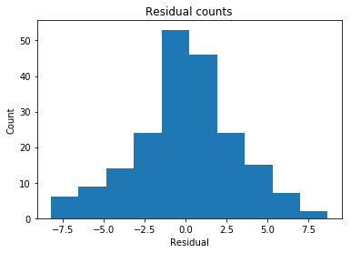
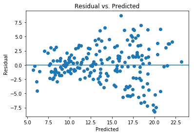
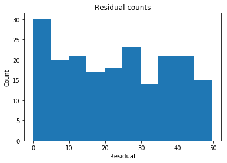

```python
import math
import warnings

from IPython.display import display
from matplotlib import pyplot as plt
import numpy as np
import pandas as pd
import seaborn as sns
from sklearn import linear_model
import statsmodels.formula.api as smf

# Display preferences.
%matplotlib inline
pd.options.display.float_format = '{:.3f}'.format

# Suppress annoying harmless error.
warnings.filterwarnings(
    action="ignore",
    module="scipy",
    message="^internal gelsd"
)
```


```python
from sklearn.preprocessing import StandardScaler
from sklearn.decomposition import PCA 


# Acquire, load, and preview the data.
data = pd.read_csv('https://tf-curricula-prod.s3.amazonaws.com/data-science/Advertising.csv')
display(data.head())

# Instantiate and fit our model.
regr = linear_model.LinearRegression()
Y = data['Sales'].values.reshape(-1, 1)
data['News_sqrt'] = np.sqrt(data['Newspaper'])
sklearn_pca = PCA(n_components=2)
raw_pca = sklearn_pca.fit_transform(data[['TV', 'Radio']])
data['pca_norm'] = raw_pca[:, 0]
X = data[['pca_norm', 'News_sqrt']]
regr.fit(X, Y)

# Inspect the results.
print('\nCoefficients: \n', regr.coef_)
print('\nIntercept: \n', regr.intercept_)
print('\nR-squared:')
print(regr.score(X, Y))
```


<div>
<style scoped>
    .dataframe tbody tr th:only-of-type {
        vertical-align: middle;
    }

    .dataframe tbody tr th {
        vertical-align: top;
    }

    .dataframe thead th {
        text-align: right;
    }
</style>
<table border="1" class="dataframe">
  <thead>
    <tr style="text-align: right;">
      <th></th>
      <th>Unnamed: 0</th>
      <th>TV</th>
      <th>Radio</th>
      <th>Newspaper</th>
      <th>Sales</th>
    </tr>
  </thead>
  <tbody>
    <tr>
      <th>0</th>
      <td>1</td>
      <td>230.100</td>
      <td>37.800</td>
      <td>69.200</td>
      <td>22.100</td>
    </tr>
    <tr>
      <th>1</th>
      <td>2</td>
      <td>44.500</td>
      <td>39.300</td>
      <td>45.100</td>
      <td>10.400</td>
    </tr>
    <tr>
      <th>2</th>
      <td>3</td>
      <td>17.200</td>
      <td>45.900</td>
      <td>69.300</td>
      <td>9.300</td>
    </tr>
    <tr>
      <th>3</th>
      <td>4</td>
      <td>151.500</td>
      <td>41.300</td>
      <td>58.500</td>
      <td>18.500</td>
    </tr>
    <tr>
      <th>4</th>
      <td>5</td>
      <td>180.800</td>
      <td>10.800</td>
      <td>58.400</td>
      <td>12.900</td>
    </tr>
  </tbody>
</table>
</div>


    
    Coefficients: 
     [[0.04711249 0.4316614 ]]
    
    Intercept: 
     [11.80381578]
    
    R-squared:
    0.6416730515462843


```python
# Extract predicted values.
predicted = regr.predict(X).ravel()
actual = data['Sales']

# Calculate the error, also called the residual.
residual = actual - predicted

# This looks a bit concerning.
plt.hist(residual)
plt.title('Residual counts')
plt.xlabel('Residual')
plt.ylabel('Count')
plt.show()
```





```python
plt.scatter(predicted, residual)
plt.xlabel('Predicted')
plt.ylabel('Residual')
plt.axhline(y=0)
plt.title('Residual vs. Predicted')
plt.show()
```





```python
correlation_matrix = X.corr()
display(correlation_matrix)
```


<div>
<style scoped>
    .dataframe tbody tr th:only-of-type {
        vertical-align: middle;
    }

    .dataframe tbody tr th {
        vertical-align: top;
    }

    .dataframe thead th {
        text-align: right;
    }
</style>
<table border="1" class="dataframe">
  <thead>
    <tr style="text-align: right;">
      <th></th>
      <th>pca_norm</th>
      <th>News_sqrt</th>
    </tr>
  </thead>
  <tbody>
    <tr>
      <th>pca_norm</th>
      <td>1.000</td>
      <td>0.047</td>
    </tr>
    <tr>
      <th>News_sqrt</th>
      <td>0.047</td>
      <td>1.000</td>
    </tr>
  </tbody>
</table>
</div>


```python
plt.hist(data['Radio'])
plt.title('Residual counts')
plt.xlabel('Residual')
plt.ylabel('Count')
plt.show()
```




