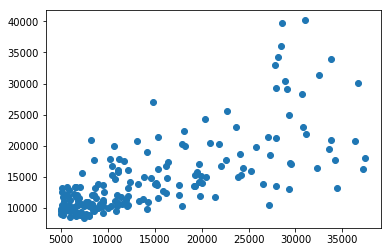

```python
get_ipython().run_line_magic('matplotlib', 'inline')
import numpy as np
import pandas as pd
import scipy
import sklearn
import matplotlib.pyplot as plt
import seaborn as sns
from sklearn import linear_model
import re
from sklearn.naive_bayes import BernoulliNB

#df = pd.read_csv("Google Drive/Python/imdb_labelled.txt", delimiter= '\t', header=None)
#raw = pd.read_csv("Google Drive/Python/FBIcrime.txt", dtype={3: int, 6: int}, header=None, keep_default_na=False)
raw = pd.read_csv("Google Drive/Python/FBIcrime.txt", header=None)
df_raw = raw[5:352].copy()

df_raw.rename(columns={1: 'Population', 0: 'City', 2: 'Violent_crime', 3: 'Murder', 4: 'Rape_revised', 5: 'Rape_legacy', 6: 'Robbery', 7: 'Aggrevated_assault', 8: 'Property_crime', 9: 'Burglary', 10: 'Larceny_theft', 11: 'Motor_vehicle_theft', 12: 'Arson'}, inplace=True)
#df = df_raw[df_raw['City'] != 'New York'].copy()
#df = df_raw[(df_raw['Robbery'] < 300) & (df_raw['Murder'] < 12)].copy()
#df_raw.apply(lambda x: '' in x.values, axis=1).any()
df = df_raw[df_raw['Violent_crime'] != ''].copy()
```


```python
#df.dtypes
df['Violent_crime'] = df['Violent_crime'].apply(lambda x: int(x.replace(',', '')))
df['Robbery'] = df['Robbery'].apply(lambda x: int(x.replace(',', '')))
df['Murder'] = df['Murder'].apply(lambda x: int(x.replace(',', '')))
df = df[(df['Robbery'] < 300) & (df['Murder'] < 12)]
#df['Robbery'] = df['Robbery'].apply(lambda x: 1 if x > 0 else 0)
#df['Murder'] = df['Murder'].apply(lambda x: 1 if x > 0 else 0)
df['Population'] = df['Population'].apply(lambda x: int(x.replace(',', '')))
df['Burglary'] = df['Burglary'].apply(lambda x: int(x.replace(',', '')))
df['Larceny_theft'] = df['Larceny_theft'].apply(lambda x: int(x.replace(',', '')))
df['Property_crime'] = df['Property_crime'].apply(lambda x: int(x.replace(',', '')))
df['Motor_vehicle_theft'] = df['Motor_vehicle_theft'].apply(lambda x: int(x.replace(',', '')))
df = df[(df['Population'] < 40000) & (df['Population'] > 5000)]
#mask = np.all(np.isnan(df) | np.equal(df, 0), axis=1)
#df_cleaned = df[~mask]
#df['Population2'] = df['Population'] ** 2
```


```python
from sklearn.decomposition import PCA 

sklearn_pca = PCA(n_components=3)
raw_pca = sklearn_pca.fit_transform(df[['Property_crime', 'Burglary', 'Larceny_theft']])
df['pca_pcbltmvt'] = raw_pca[:, 0]
```


```python
sklearn_pca = PCA(n_components=3)
raw_pca = sklearn_pca.fit_transform(df[['Violent_crime', 'Murder', 'Robbery']])
df['pca_vcmltmvt'] = raw_pca[:, 0]
```


```python
#Propertycrime=α+Population+Population2+Murder+Robbery

regr = linear_model.LinearRegression()
Y = df['Population'].values.reshape(-1, 1)
#X = df[['Population', 'Population2', 'Murder', 'Robbery']]
X = df[['pca_pcbltmvt', 'pca_vcmltmvt', 'Aggrevated_assault', 'Rape_legacy', 'Motor_vehicle_theft']]
regr.fit(X, Y)

# Inspect the results.
print('\nCoefficients: \n', regr.coef_)
print('\nIntercept: \n', regr.intercept_)
print('\nR-squared:')
print(regr.score(X, Y))
```

    
    Coefficients: 
     [[  14.07871909   95.91276125 -144.41543592 -460.54717045  261.8758621 ]]
    
    Intercept: 
     [16210.92075167]
    
    R-squared:
    0.48866170061777614


    /usr/local/lib/python3.6/site-packages/scipy/linalg/basic.py:1226: RuntimeWarning: internal gelsd driver lwork query error, required iwork dimension not returned. This is likely the result of LAPACK bug 0038, fixed in LAPACK 3.2.2 (released July 21, 2010). Falling back to 'gelss' driver.
      warnings.warn(mesg, RuntimeWarning)


```python
predicted = regr.predict(X).ravel()
actual = df['Population']

# Calculate the error, also called the residual.
residual = actual - predicted

# This looks a bit concerning.
plt.hist(residual)
plt.title('Residual counts')
plt.xlabel('Residual')
plt.ylabel('Count')
plt.show()
```


```python
plt.scatter(actual, predicted)
```


    <matplotlib.collections.PathCollection at 0x10ae46e80>




